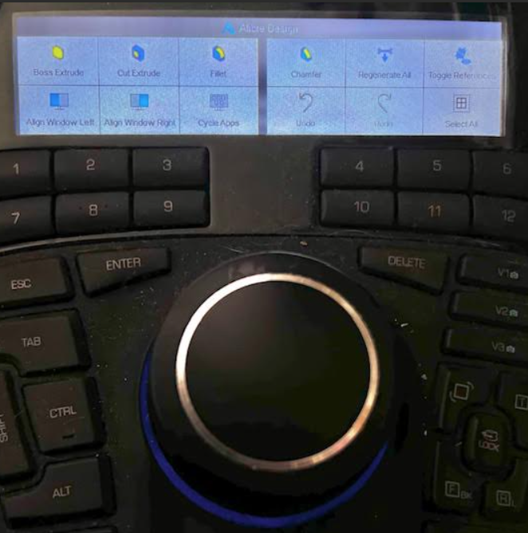

This is a XML file which defines graphical macro buttons on my SpaceMouse Enterprices (The 3D mouse has  12 LCD buttons) to have the most used buttons for Alibre Design shown with graphical buttons

</img>

The 3DConnection tool can generate this file and the tool looks at which executable program is being used and then dynamically chooses the right XML file for that tool. 

In the case for using Alibre Design the tool creates a file named "Alibre Design V2.xml" in the folder: <code>C:\Users\henrik\AppData\Roaming\3Dconnexion\3DxWare\Cfg</code>

Henrik is my name you have to replace this with your own account.

